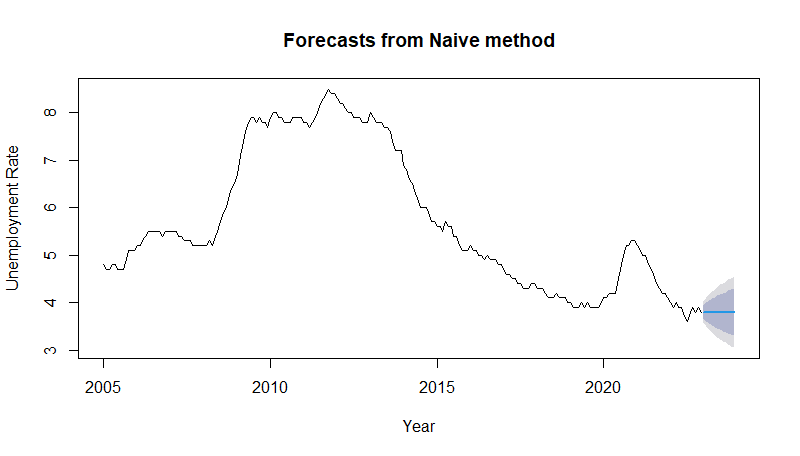
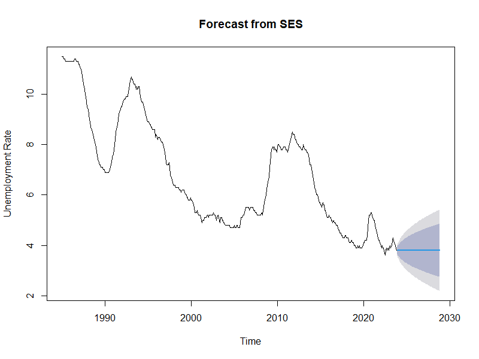
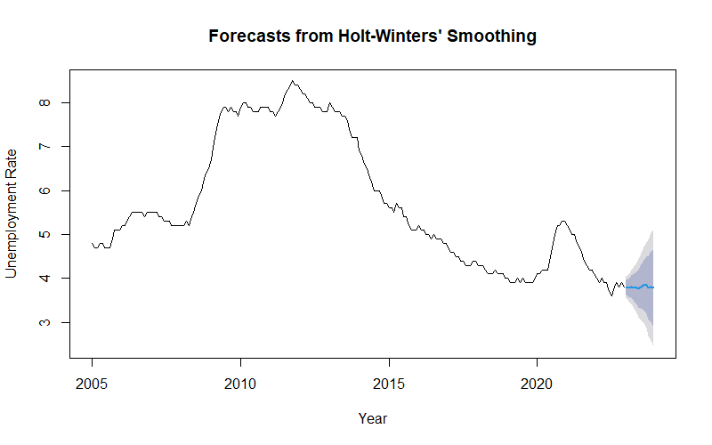
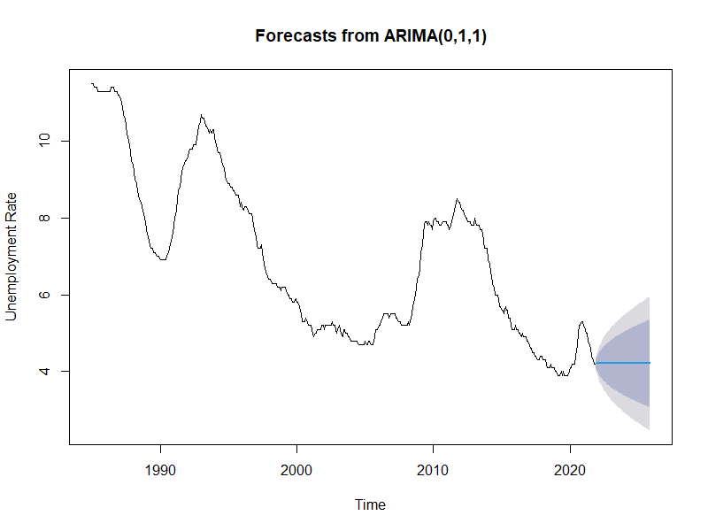
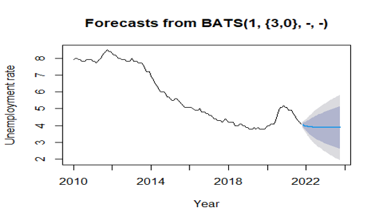
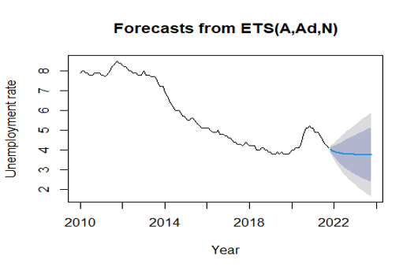

# 📊 UK Unemployment Rate Forecasting

This repository contains an analysis and forecasting of the **UK Unemployment Rate** using various time series models in R.  
The objective is to determine the most accurate forecasting method by comparing the **Mean Absolute Percentage Error (MAPE)** across different models.

---

## 📌 Project Overview

The project demonstrates:
- Data cleaning and preparation
- Creation of a monthly time series object
- Visualization of unemployment rate trends and seasonality
- Model fitting with various forecasting techniques
- Model comparison using MAPE

---

## 📂 Dataset

- **Source:** UK Unemployment Rate data (`unemp_rate.xls`)
- **Period:** January 2010 – Latest available month
- **Frequency:** Monthly

---

## 🔧 Methodology

### 1. Data Preparation
- Read Excel data with `readxl::read_xls()`
- Created monthly time series using `ts()`  
- Split data into training and testing sets for validation

### 2. Evaluation Metric  
We used **Mean Absolute Percentage Error (MAPE)**:
```r
mape <- function(actual, pred) {
  mean(abs((actual - pred) / actual)) * 100
}
```

| Model | Description | MAPE (%) |
|-------|-------------|----------|
| **Naive Method** | Uses last observation as forecast | 9.49 |
| **Simple Exponential Smoothing (SES)** | Weighted average with exponential decay | 9.49 |
| **Holt’s Trend Method** | Accounts for trend in the data | 8.55 |
| **ARIMA** | Auto ARIMA model selection | **2.40** |
| **TBATS** | Handles complex seasonality patterns | 5.07 |
| **ETS** | Error-Trend-Seasonality model | 3.22 |


## 📈 Forecasting Models (Detailed)

Below are the forecasting models used, their purpose, and performance based on MAPE (%).  

---

### 1. Naive Method  
Uses the last observation as the forecast for the next period.  
Simple to implement but does not account for trend or seasonality.  
**MAPE:** 9.49%  


---

### 2. Simple Exponential Smoothing (SES)  
Calculates forecasts as weighted averages of past observations with exponentially decreasing weights.  
Best suited for data without trends or seasonality.  
**MAPE:** 9.49%  


---

### 3. Holt’s Trend Method  
An extension of SES that also models a trend component in the data.  
Useful for series with upward or downward trends.  
**MAPE:** 8.55%  


---

### 4. ARIMA  
Auto-Regressive Integrated Moving Average model selected automatically (`auto.arima()` in R).  
Can handle trend, seasonality, and autocorrelation.  
**Best performer in this study.**  
**MAPE:** **2.40%**  


---

### 5. TBATS  
Flexible model capable of handling multiple and non-integer seasonality patterns.  
Includes Box-Cox transformations, ARMA errors, and trend modeling.  
**MAPE:** 5.07%  


---

### 6. ETS (Error-Trend-Seasonality)  
Models error, trend, and seasonal components explicitly.  
Performs well for seasonal and trend-driven series.  
**MAPE:** 3.22%  


---

## 📊 Key Findings

- **ARIMA** was the most accurate model with the lowest MAPE (**2.40%**).  
- **ETS** and **TBATS** also delivered strong performance.  
- **Holt’s Trend Method** performed better than Naive and SES but was outperformed by ARIMA, ETS, and TBATS.  
- Naive and SES methods serve as useful benchmarks but are less accurate for this dataset.  

